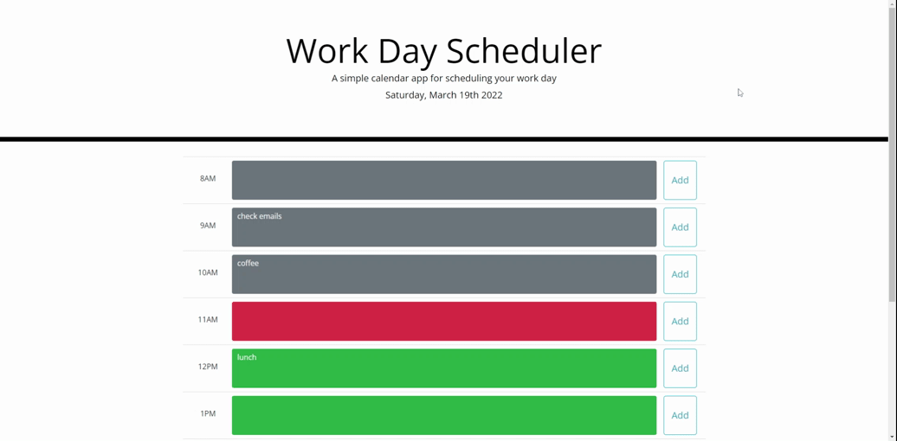

# Bootstrap Workday Scheduler

## Description

This application is a take on a simple day planner that allows a user to save events for each work hour of the day.

A row is allotted for each hour from 8AM up to 5PM. Each row consists of the time label, a text area where the events can be written, and a save button to save what was written in the text area. The saved events would persist even after refreshing the page. Each time block is color coded to indicate whether the hour is past, is the current, or the future.

In the way that this application is coded, the events saved for a certain date and timeblock (e.g. today at 9AM) would not be shown when the page is loaded on another date as the keys that were used for saving the events include both the timeblock and date when the event was saved.

The application is done using HTML, CSS, and JavaScript powered by third-party API's such as Bootstrap, Moment.js, and jQuery.

## Website

The following animation shows the web application's appearance and functionality:

## Demo

Visit [this](https://alainatividad.github.io/Bootstrap-WorkDay-Scheduler/) to see the webapp in action.
